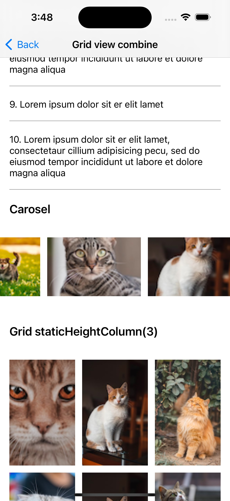

# CompositionalGridView

[](https://travis-ci.org/tiennv166/CompositionalGridView)
[](https://cocoapods.org/pods/CompositionalGridView)
[](https://cocoapods.org/pods/CompositionalGridView)
[](https://cocoapods.org/pods/CompositionalGridView)

A library that allows arranging views in grid or list format, scrolling horizontally or vertically with `just a few lines of code`. (No need to worry about `UITableView` or `UICollectionView`.)

## Introduction
`CompositionalGridView` supports some main features:

- Item widths based on a fraction of the total available width
	- Full width for a list layout (similar to `UITableView`)
	- Half-width, third-width, etc. for a grid layout
- The layout of the grid view is similar to wrapping text (based on the size of each item and the screen size)
- Horizontal scrolling (similar to Carousel style)
- Capable of scrolling both horizontally and vertically in a single grid view.
- Embed UIView/UIViewController into a cell of collection view

Other convenience features:
- Enable/disable Pull to refresh
- Enable/disable Load more
- Handle cell event (for example, if the user taps on a button inside the cell)

| List Layout | Third-width (static height) | Third-width (dynamic height) | 
| --- | --- | --- |
|  |   |  |

| Normal style  | Carousel style (Orthogonal scrolling) | Combine |
| --- | --- | --- |
|  |  |  |

Allows configuring all of styles in the same view with just a few lines of code.
Now, we just need to focus on coding the data model, no need to code the layout and view (tableview or colection view)


## Example

To run the example project, clone the repo, and run `pod install` from the Example directory first.

`To Be Updated`

## Requirements

- Deployment target iOS 13.0+
- Swift 5+

## Installation

CompositionalGridView is available through [CocoaPods](https://cocoapods.org). To install
it, simply add the following line to your Podfile:

```ruby
pod 'CompositionalGridView'
```

## Author

tiennv166, tiennv166@gmail.com

## License

CompositionalGridView is available under the MIT license. See the LICENSE file for more info.
