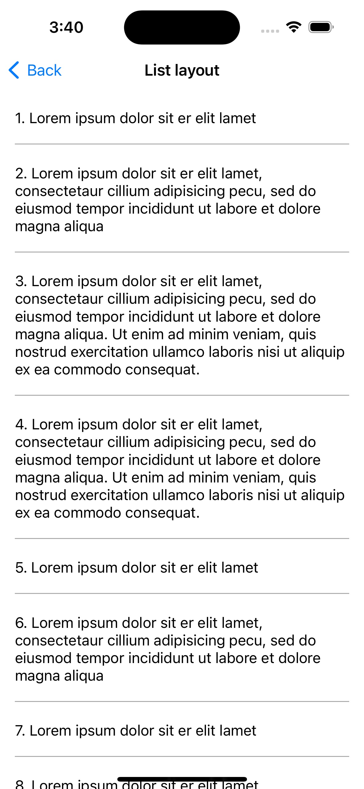
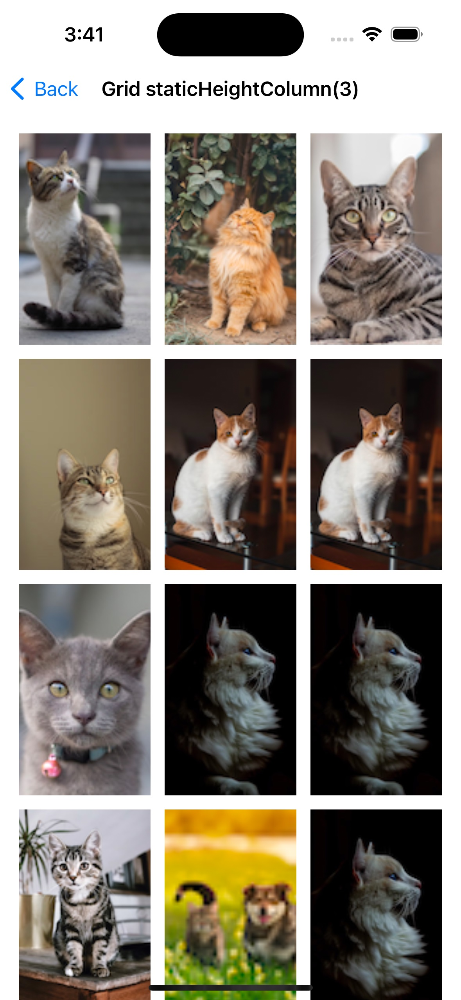
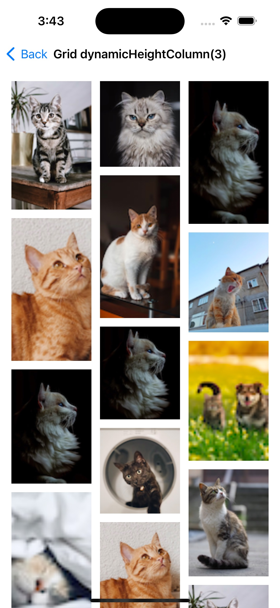
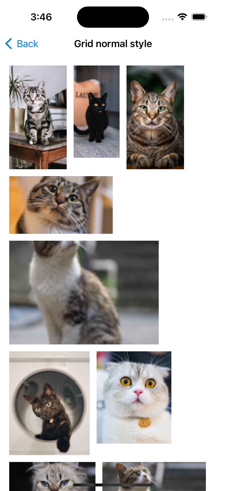
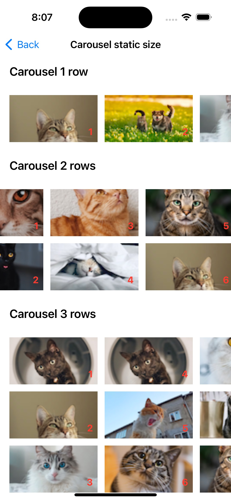
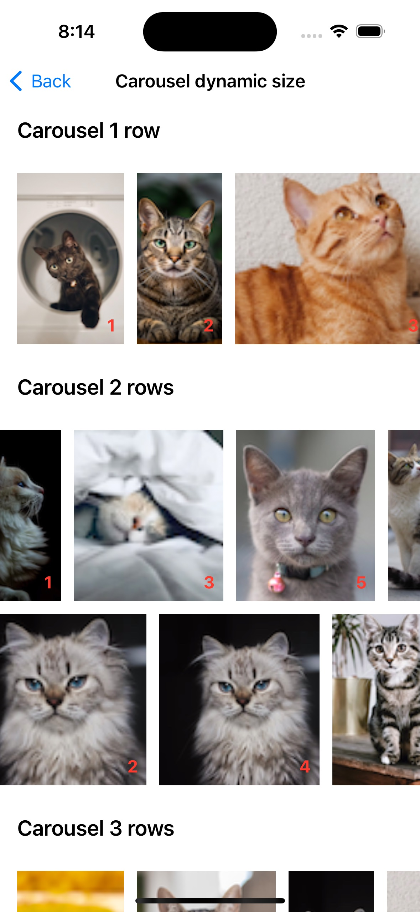

# CompositionalGridView

[](https://travis-ci.org/tiennv166/CompositionalGridView)
[](https://cocoapods.org/pods/CompositionalGridView)
[](https://cocoapods.org/pods/CompositionalGridView)
[](https://cocoapods.org/pods/CompositionalGridView)

A library that allows arranging views in grid or list format, scrolling horizontally or vertically with `just a few lines of code`. (No longer need to worry about `UITableView` or `UICollectionView`.)

## Introduction
`CompositionalGridView` provides several key features:
- Item widths based on a fraction of the total available width
	- Full width for a list layout (similar to `UITableView`)
	- Half-width, third-width, etc. for a grid layout
- The layout is similar to text wrapping, based on the size of each item and the screen size
- Horizontal scrolling with one or multiple rows (similar to sarousel or paging style)
- Capability to scroll both horizontally and vertically within a single grid view
- Supplementary view for each section (pinned (a.k.a sticky) header/footer)
- Self-sizing items, headers and footers
- Ability to embed UIView/UIViewController within a cell of a grid view

Other useful features:
- Specifying horizontal item spacing on a per-section basis
- Specifying vertical row spacing on a per-section basis
- Specifying section insets on a per-section basis
- Enable/disable pull to refresh
- Enable/disable load more
- Event handling for cells, allowing for actions such as tapping a button inside a cell

| List Layout (like table view) with self-sizing item| Third-width (static height) | Third-width (dynamic height) | 
| --- | --- | --- |
|  |   |  |

| Normal style (like Text Wrapping) | Carousel static size (Orthogonal scrolling) | Carousel dynamic size (Orthogonal scrolling) |
| --- | --- | --- |
|  |  |  |

Allows configuring all of styles in the same view with just a few lines of code.
Now we can solely focus on coding the data model, without needing to code the layout and view (table view or collection view).


## Example

To run the example project, clone the repo, and open `CompositionalGridView.xcodeproj` from the code directory.
An example app is available to showcase and allow you to test some of the features of `CompositionalGridView`.

## Requirements

- Deployment target iOS 13.0+
- Swift 5+

## Installation

CompositionalGridView is available through [CocoaPods](https://cocoapods.org). To install
it, simply add the following line to your Podfile:

```ruby
pod 'CompositionalGridView'
```

## Building a `CompositionalGridView`
Once you've installed `CompositionalGridView` into your project, getting a basic grid view working is just a few steps.

### Basic Setup

#### Importing `CompositionalGridView`
At the top of the file where you'd like to use `CompositionalGridView` (likely a `UIView` or `UIViewController` subclass), import `CompositionalGridView`:
```swift
import CompositionalGridView 
```

#### Initializing a `CompositionalGridView`
```swift
let gridView = CompositionalGridView()
```
Make sure to add the `gridView` as a subview to another view
```swift
gridView.addTo(view)
```

#### Configuring the delegate
Set CompositionalGridView's delegate property to an object conforming to [`CompositionalGridViewDelegate`](CompositionalGridView/Classes/GridView/CompositionalGridView.swift#L14).
```swift
gridView.setDelegate(self)
```
Here's an example delegate implementation:
```swift
extension ViewController: CompositionalGridViewDelegate {
    func gridViewDidTriggerReload(_ gridView: CompositionalGridView) {
        // Handle pull to refresh event
    }
    
    func gridViewDidTriggerLoadMore(_ gridView: CompositionalGridView) {
        // Handle load more event
    }
    
    func gridViewDidSelectItem(_ gridView: CompositionalGridView, item: GridItemModelConfigurable) {
        guard let item = item as? OutlineItemCellModel else { return }
        // Handle `OutlineItemCellModel` item selection event
    }
    
    func gridViewDidTriggerEvent(_ gridView: CompositionalGridView, event: GridCellEvent) {
        guard let event = event as? OutlineItemCellEvent else { return }
        // Handle a cell event inside a cell
    }
}
```

#### Configuring the grid view Settings
[`GridViewSettings`](CompositionalGridView/Classes/Public/GridViewSettings.swift) is used to set up content insets, background color, and enable/disable pull to refresh, load more, and vertical scrolling.
```swift
let settings = GridViewSettings(isReloadEnabled: true, isLoadMoreEnabled: true)
gridView.setSettings(settings)
```

### Setting up cells and supplementary views

The core of grid view is its item, which is defined in the [`GridItemModelConfigurable`](CompositionalGridView/Classes/Public/Core/GridItemModelConfigurable.swift) protocol.
```swift
public protocol GridItemModelConfigurable {
    var layoutIndex: GridLayout.Index { get }
    var identity: String { get }
    var reuseIdentifier: String { get }
    var viewType: GridLayout.ViewType { get }
    var itemSize: GridLayout.Size { get }
    var itemSpacing: CGFloat { get }
    var lineSpacing: CGFloat { get }
    func isEqualTo(_ other: GridItemModelConfigurable) -> Bool
}
```
and [`GridLayout`](CompositionalGridView/Classes/Public/Core/GridLayout.swift)

Item configuration options:
- layout index ([GridLayout.Index](CompositionalGridView/Classes/Public/Core/GridLayout.swift#L118))
    - Section index (will create a new section if one does not exist for the specified index)
    - Item index (position or `row` in the specified section)
    - [the layout type of the section](CompositionalGridView/Classes/Public/Core/GridLayout.swift#L44)
- `identity` is used for unique identification
- `reuseIdentifier` is used to dequeue reusable cells or supplementary views
- `itemSpacing` is used to specify the horizontal spacing between items (the default value is 0)
- `lineSpacing` is used to specify vertical row spacing (the default value is 0)
- `itemSize` ([GridLayout.Size](CompositionalGridView/Classes/Public/Core/GridLayout.swift#L19)) controls the size of each item and has 3 modes:
    - `fit`: the item width fits the entire container (does not support fitting the height)
    - `fixed`: the item has an exact size
    - `estimated`: used for self-sizing items with an estimated size at the beginning
- `viewType` ([GridLayout.ViewType](CompositionalGridView/Classes/Public/Core/GridLayout.swift#L77)) is used to determine the type of each item: cell, self handling, header or footer
    - `cell`: the cell linked with the class type of `UICollectionViewCell`
    - `selfHandling`: an item that embeds a UIView or UIViewController inside
    - `header/footer`: the supplementary view linked with the class type of `UICollectionReusableView`
    
#### Setting up a cell
Firstly, initialize your own collection view cell and its corresponding cell model
```swift
struct OutlineItemCellModel {
...
}
class OutlineItemCell: UICollectionViewCell {
...
}
```

Then, make sure that the model conforms to `GridItemModelConfigurable` and links it to the your cell by class type
```swift
extension OutlineItemCellModel: GridItemModelConfigurable {
    var identity: String { ... }
    var reuseIdentifier: String { "OutlineItemCell" }
    
    // The view type is .cell, which links to your cell's class type
    var viewType: GridLayout.ViewType { .cell(OutlineItemCell.self) }
    var itemSize: GridLayout.Size { .init(width: .fit, height: .estimated(60)) }
    var layoutIndex: GridLayout.Index { .init(section: GridLayout.Section(index: section, style: .normal)) }
}
```

Finally, make sure that the cell conforms to `GridCellConfigurable` protocol and overrides the `configure` function
```swift
extension OutlineItemCell: GridCellConfigurable {
    func configure(_ model: OutlineItemCellModel) -> UICollectionViewCell {
        // configure your cell here with corresponding model
        ...
        return self
    }
}
```

#### Setting up a supplementary view
Firstly, initialize your own header/footer view (a subclass of `UICollectionReusableView`) and its corresponding model
```swift
struct HeaderModel {
...
}
class HeaderView: UICollectionReusableView {
...
}
```

Then, make sure that the model conforms to `GridItemModelConfigurable` and links it to the your view by class type
```swift
extension HeaderModel: GridItemModelConfigurable {
    var identity: String { ... }
    var reuseIdentifier: String { "HeaderView" }
    
    // The view type is .header (or .footer), which links to your supplementary view's class type
    var viewType: GridLayout.ViewType { .header(HeaderView.self) }
    var itemSize: GridLayout.Size { .init(width: .fit, height: .estimated(60)) }
    var layoutIndex: GridLayout.Index { .init(section: GridLayout.Section(index: section, style: .normal)) }
}
```

Finally, make sure that the supplementary conforms to `GridSupplementaryViewConfigurable` protocol and overrides the `configure` function
```swift
extension HeaderView: GridSupplementaryViewConfigurable {
    func configure(_ model: HeaderModel) -> UICollectionReusableView {
        // configure your view here with corresponding model
        ...
        return self
    }
}
```

#### Updating items for the grid view

After setting up the cell or supplementary models, it's time to update items to the grid view.
Use the `updateItems` function to update the items for the grid view.
```swift
public func updateItems(_ items: [GridItemModelConfigurable], hasNext: Bool = false)
```
This function typically takes two parameters:
- `items`: This is an array of the `GridItemModelConfigurable` type that contains the new items to be displayed in the grid view.
- `hasNext`: This parameter is optional and is used to indicate whether or not there are more items to be loaded in the grid view. If this parameter is set to true, it enables the `load more` functionality in the grid view.

```swift
let header: HeaderModel = ...
let items: [OutlineItemCellModel] = ...
let hasNext: Bool = ...
gridView.updateItems([header] + items, hasNext: hasNext)
```

Note that there is no need to register the cell type or supplementary type beforehand, as this is done automatically by the grid view when the items are updated.
    
#### Embed a UIView/UIViewController into a grid view

To embed a view or a view controller into a grid view, we use one of two functions below: 
```swift
public func addSelfHandlingLogicItem(_ item: SelfHandlingItemModel, viewController: UIViewController, isHidden: Bool)
public func addSelfHandlingLogicItem(_ item: SelfHandlingItemModel, view: UIView, isHidden: Bool)
```
and a function to show/hide a self-handling item already embeded:
```swift
public func setHiddenItem(_ isHidden: Bool, identity: String)
```
[`SelfHandlingItemModel`](CompositionalGridView/Classes/Public/SelfHandlingItemModel.swift) is the model that conforms to `GridItemModelConfigurable` to link with the `UIView/UIViewController` object.

Here's an example of how to embed a view controller into a grid view:
```swift
class GridCellViewController: UIViewController {
...
}

let viewControllerItem = SelfHandlingItemModel(
    identity: "viewController-identity",
    layoutIndex: GridLayout.Index(
        section: GridLayout.Section(
            index: 2,
            style: .normal,
            contentInsets: UIEdgeInsets(top: 16, left: 16, bottom: 0, right: 16)
        )
    ),
    itemSize: GridLayout.Size(width: .fit, height: .fixed(200))
)

gridView.addSelfHandlingLogicItem(viewControllerItem, viewController: GridCellViewController(), isHidden: false)
```

In this example, we create a `SelfHandlingItemModel` instance called `viewControllerItem`, which describes the layout and behavior of the grid item. Then we add it to the `gridView` using the `addSelfHandlingLogicItem` function along with an instance of `GridCellViewController` and the `boolean` value `false` to indicate that the item should initially be visible.

#### Handle events of a cell

To handle an event inside a cell, you should first define your cell event that conforms to the [`GridCellEvent`](CompositionalGridView/Classes/Public/GridCellEvent.swift) protocol. 
The `GridCellEvent` protocol is an empty protocol that you can use as a marker to indicate that a particular enum or struct is intended to be used as a cell event.

Here's an example of how to define a custom cell event: 
```swift
enum OutlineItemCellEvent: GridCellEvent {
    case view(String)
}
```

Once you've defined your cell event, you can use it to handle events that occur inside the cell. Here's an example of how to handle a button tap event inside a cell:
```swift
class OutlineItemCell: UICollectionViewCell {
    
    var itemId: String?
    private var eventHandler: ((GridCellEvent) -> Void)?

    @IBAction private func buttonTapped(_ sender: Any) {
        itemId.flatMap { eventHandler?(OutlineItemCellEvent.view($0)) }
    }
}
```

Finally, ensure that your `OutlineItemCell` conforms to the `GridCellConfigurable` protocol and overrides the `handleEvent` function:
```swift
extension OutlineItemCell: GridCellConfigurable {
    func handleEvent(_ event: @escaping ((GridCellEvent) -> Void)) {
        eventHandler = event
    }
}
```

### CompositionalGridView+Reactive

`CompositionalGridView` already has 2 public `publishers` - `contentSize` and `contentOffset` - which allow subscribers to listen to changes (using Swift `Combine`).

[`CompositionalGridView+Combine`](CompositionalGridView/Classes/GridView/CompositionalGridView.swift#L428)

If your project uses `RxSwift` instead of `Combine`, you can convert those publishers to `Observable` as shown below:

```swift
import Combine
import CompositionalGridView
import RxRelay
import RxSwift

private struct AssociatedKeys {
    static var Cancellable = "observable_cancellable"
}

extension Reactive where Base: CompositionalGridView {

    var contentSize: Observable<CGSize> {
        let size = BehaviorRelay<CGSize>(value: .zero)
        let cancellable = base.contentSizePublisher.sink { size.accept($0) }
        // Store cancellable
        objc_setAssociatedObject(size, &AssociatedKeys.Cancellable, cancellable, .OBJC_ASSOCIATION_RETAIN_NONATOMIC)
        return size.asObservable()
    }
    
    var contentOffset: Observable<CGPoint> {
        let offset = BehaviorRelay<CGPoint>(value: .zero)
        let cancellable = base.contentOffsetPublisher.sink { offset.accept($0) }
        // Store cancellable
        objc_setAssociatedObject(offset, &AssociatedKeys.Cancellable, cancellable, .OBJC_ASSOCIATION_RETAIN_NONATOMIC)
        return offset.asObservable()
    }
}
```

## Author

tiennv166, tiennv166@gmail.com

## License

CompositionalGridView is available under the MIT license. See the LICENSE file for more info.
